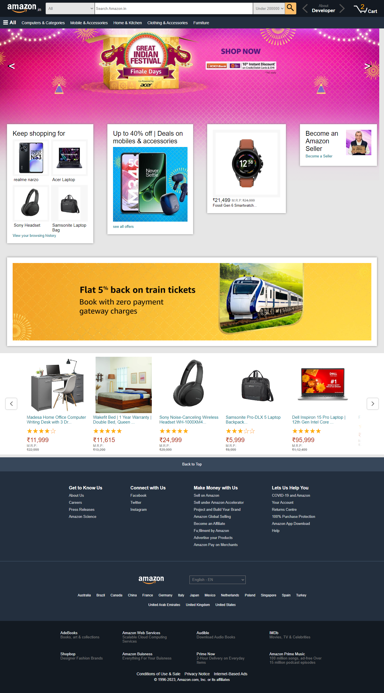
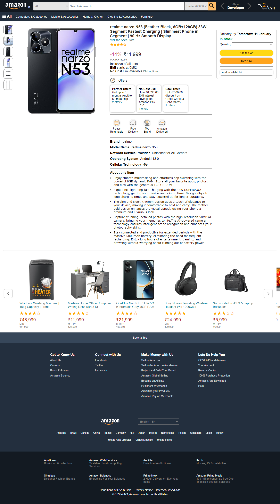
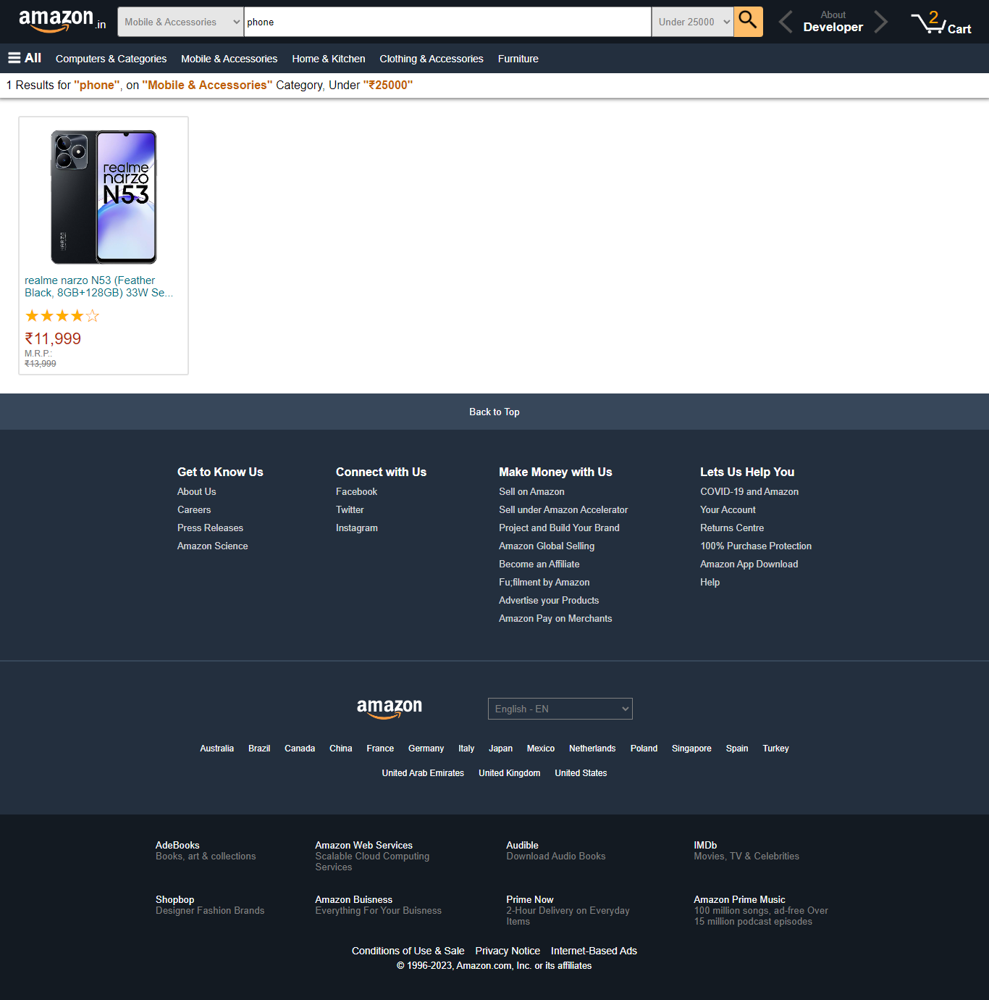
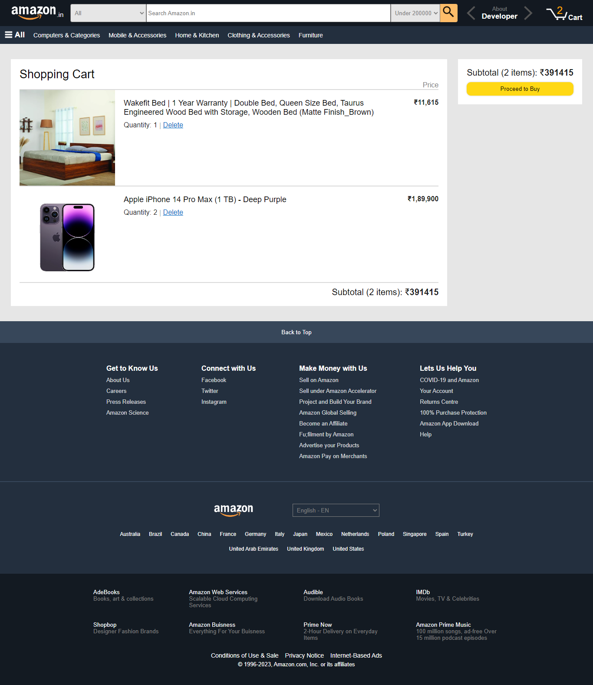

Pixel Perfect and Fully Component based React Application. Similar to official [Amazon](https://www.amazon.in/)

## Tech Stack Used

- React
- ReocilJS
- Vanilla CSS

## Features

➡️Search-Filter with 3 params (category, text, max-price range).

➡️Searched-products page.

➡️Cart Page.

➡️Add-to-Cart & Delete-from-Cart.

➡️Added four new products.

## Video Links

- [Version 1 (Without RecoilJS)](https://www.youtube.com/watch?v=i4AHrKErNyk&list=PLgSNzrXIGnTpvxguSSNluQLR5kRNnpVmv&index=1)
- [Difference After RecoilJS](https://www.youtube.com/watch?v=NoXu23FxxKQ&list=PLgSNzrXIGnTpvxguSSNluQLR5kRNnpVmv&index=2)
- [Version 2 (With RecoilJS)](https://www.youtube.com/watch?v=qptFmxAa4IM&list=PLgSNzrXIGnTpvxguSSNluQLR5kRNnpVmv&index=3)
- [Added 360 Product](https://www.youtube.com/watch?v=_WXx7NgDg2M&list=PLgSNzrXIGnTpvxguSSNluQLR5kRNnpVmv&index=4)

## Views

### Home Page

### Product Page

### Search Results Page

### Cart Page

## Other Features

### 360 View of a Product

